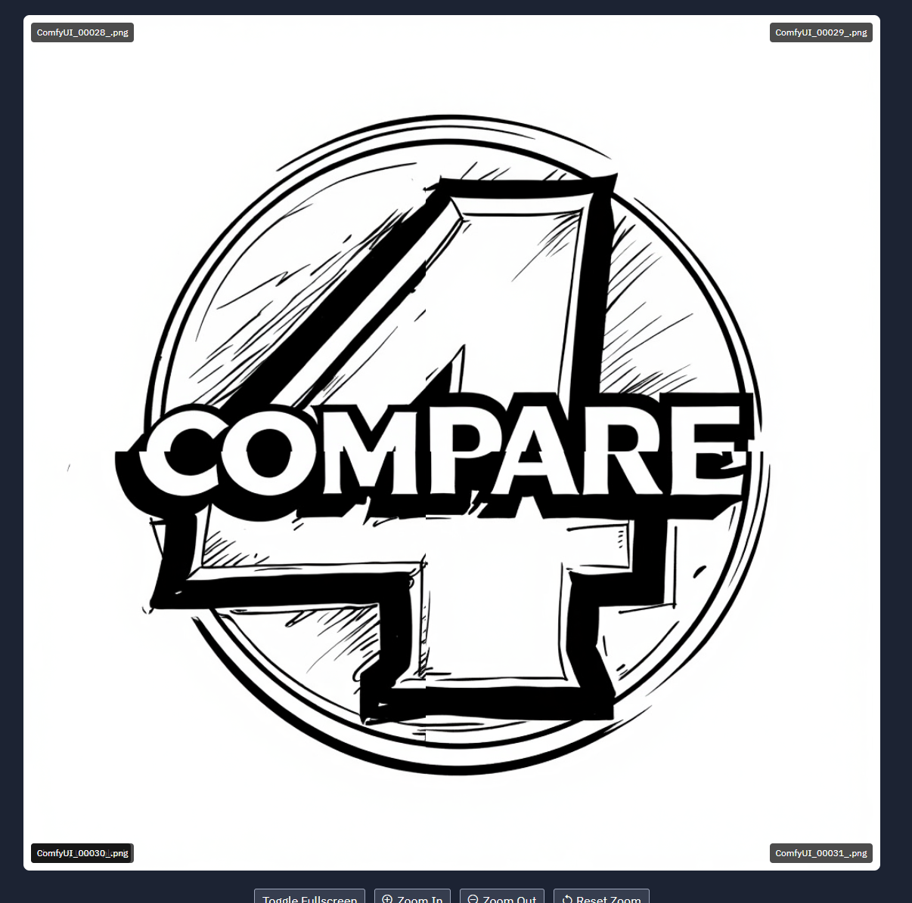
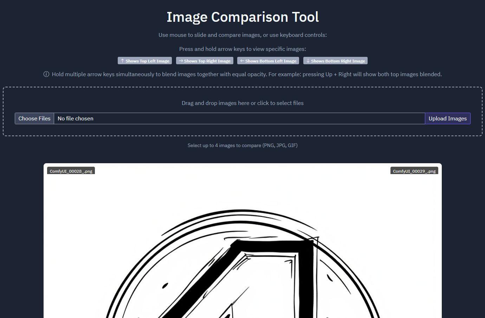
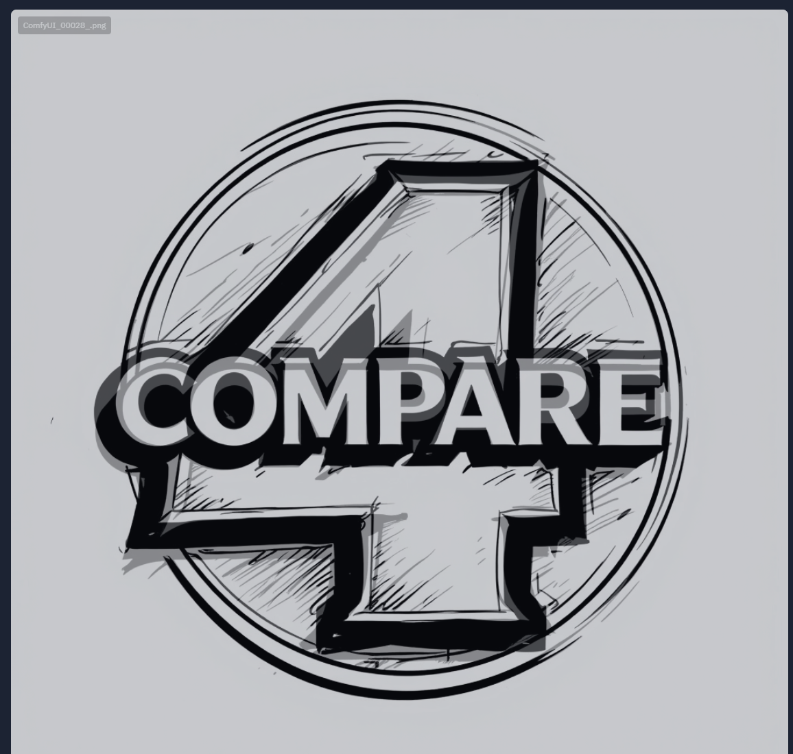

# ImageQuadrantCompare

**ImageQuadrantCompare** is a user-friendly web app that allows you to compare four images simultaneously by dividing them into quadrants. It is designed for visual analysis, making it easy to explore differences and similarities between image quadrants using intuitive controls.

## Features

- **Drag-and-Drop Interface**: Quickly upload four images for comparison.
- **Interactive Comparison**: Use the mouse to compare the four images.

- **Keyboard Navigation**: Use mouse to slide and compare images, or use keyboard controls:

Hold multiple arrow keys simultaneously to blend images together with equal opacity.
For example: pressing Up + Right will show both top images blended.

